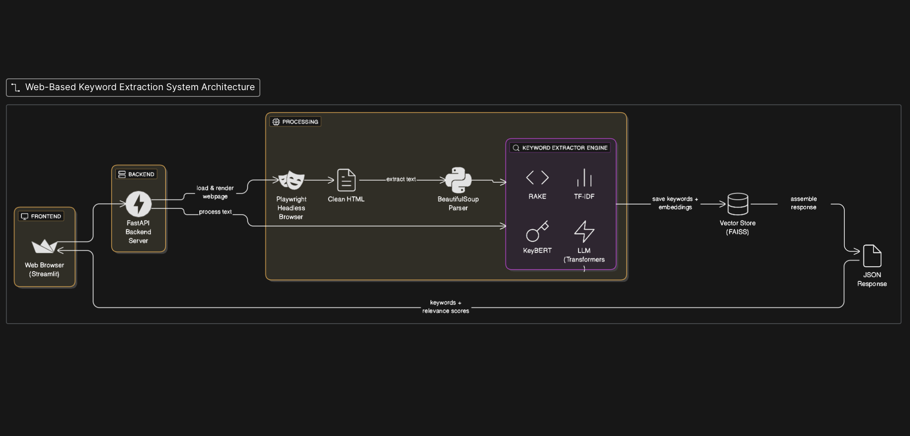
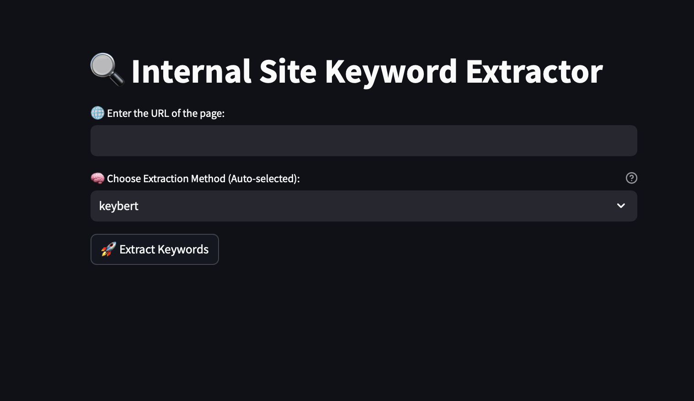

# 🚀 ⚡ The Power of LLMs: Keyword Extraction from Any Webpage (Even JS-Powered Ones!)

A full-stack AI project that extracts meaningful keywords from **any webpage**, including JavaScript-heavy sites, using **Playwright**, **LLMs**, and **Vector DBs**. Built with **FastAPI**, **Streamlit**, and **Docker**, and production-ready with **CI/CD**.

---

## 🔍 Features

- ✅ Scrapes both static and JavaScript-enabled pages using Playwright  
- ✅ Supports 4 extraction methods: `LLM`, `RAKE`, `TF-IDF`, `KeyBERT`  
- ✅ Uses SentenceTransformers for vector embeddings  
- ✅ Stores embeddings in FAISS for semantic search  
- ✅ Outputs are JSON-compatible (MongoDB-ready)  
- ✅ Fully interactive UI built with Streamlit  
- ✅ Dockerized and ready to deploy  
- ✅ GitHub Actions CI/CD pipeline included  

---

## 🧠 System Architecture

```text
Webpage (HTML or JS)
        ↓
Playwright (Headless Browser Scraper)
        ↓
Keyword Extraction (RAKE | TF-IDF | KeyBERT | LLM)
        ↓
      ┌─────► FAISS Vector Store (for semantic search)
      │
      └─────► JSON Output (MongoDB-ready)
        ↓
Streamlit UI (Visualization & Querying)
```

---

## 📁 Project Structure

```text
.
├── app/
│   ├── main.py
│   ├── scraper.py
│   ├── processor.py
│   ├── vectorstore.py
│   └── requirements.txt
├── ui/
│   └── app.py
├── diagram/
│   ├── Structure.png
│   └── Frontend.png
├── Dockerfile.backend
├── Dockerfile.frontend
├── docker-compose.yaml
└── .github/
    └── workflows/
        └── ci.yml
```

---

## 🖼️ Visuals

### 🔧 System Diagram



### 🎨 Frontend Screenshot



---

## 🧪 Run Locally Without Docker

### 🔹 Backend (FastAPI)

```bash
cd app
python3 -m venv venv
source venv/bin/activate  # On Windows: venv\Scripts\activate
pip install -r requirements.txt
python -m playwright install
uvicorn main:app --reload --port 8000
```

### 🔹 Frontend (Streamlit)

```bash
cd ui
streamlit run app.py
```

---

## 🐳 Run with Docker

```bash
docker-compose up --build
```

- Frontend: http://localhost:8501  
- Backend: http://localhost:8000  

---

## ⚙️ CI/CD Pipeline

```text
✅ Defined in .github/workflows/ci.yml  
✅ Automatically runs on every push  
✅ Builds both frontend and backend  
✅ Tests backend health using curl  
✅ Gracefully fails on issues  
✅ Uses latest Docker & GitHub runner environment  
```

---

## 🌱 Future Roadmap

```text
🔸 Integrate MongoDB Atlas for storing JSON keyword data  
🔸 Add user authentication (JWT or OAuth)  
🔸 Deploy on EC2, Azure, or Render  
🔸 Add CSV/JSON export for keyword results  
🔸 Integrate LangChain Agents for smart querying  
```

---

## 🤝 Author

```text
👤 Built by: Nikhil 
🎓 IITian, Full Stack Data Science & GenAI Specialist  
🧑‍💻 LinkedIn: https://linkedin.com/in/nikhildeka 
📬 Email: nikhiliitg07@gmail.com
```

---

## 📌 Final Note

> “From crawling the web to meaningful insights — powered by LLMs, backed by Vector DBs.”
